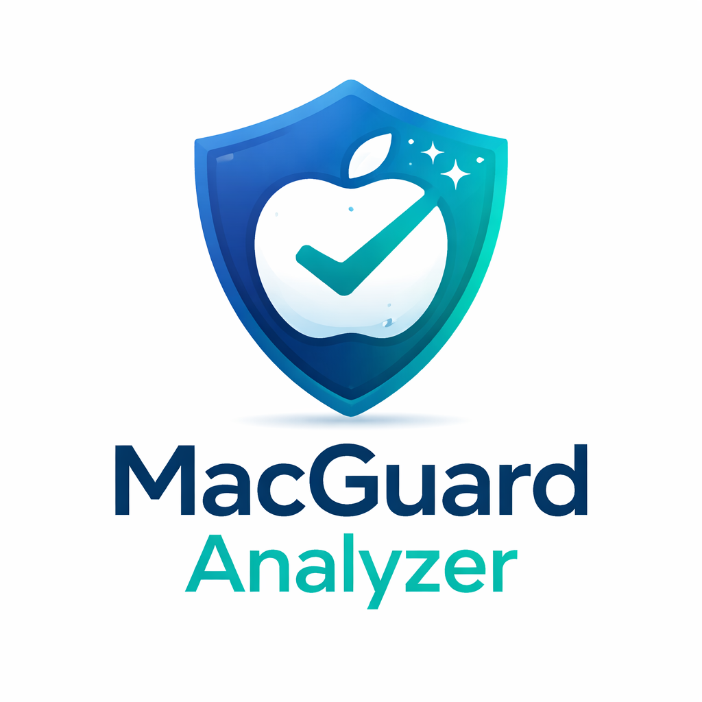
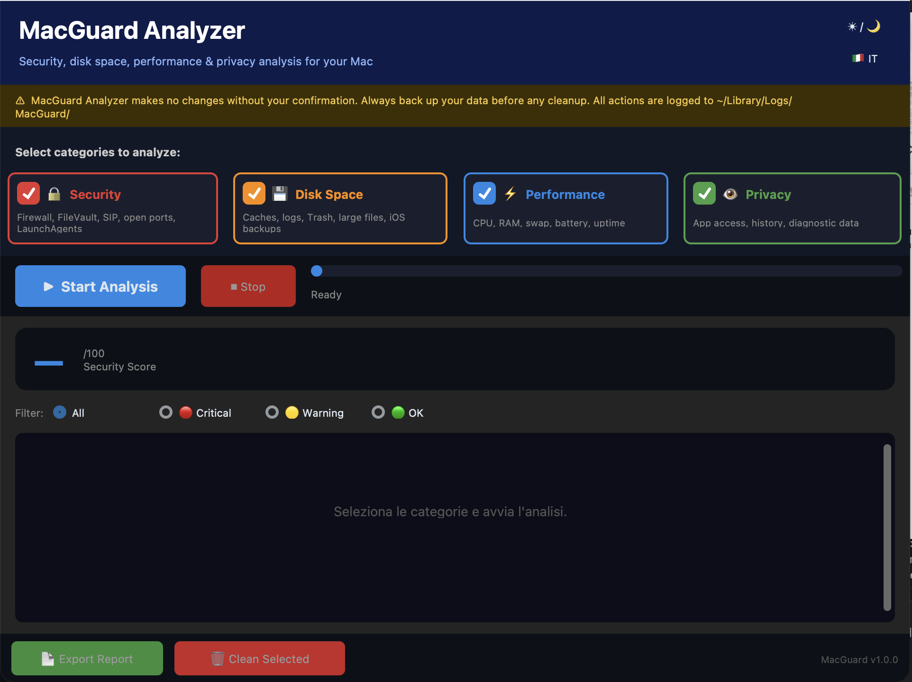
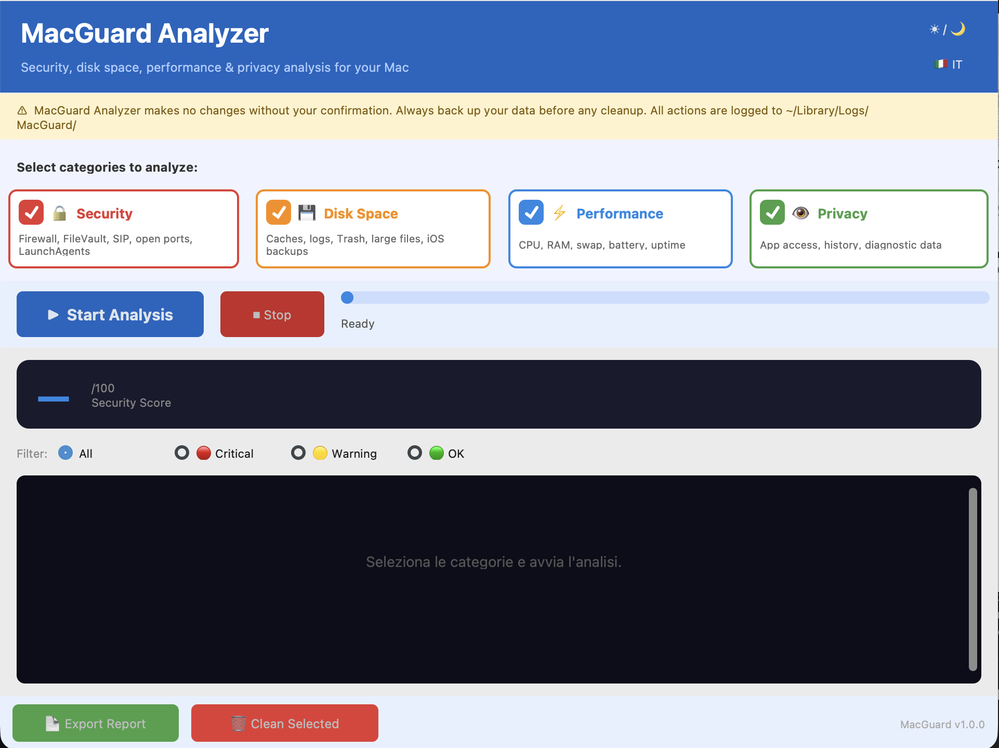

<div align="center">



# MacGuard Analyzer

**A modern macOS security and system health analyzer with a clean GUI.**  
Scan your Mac for security issues, disk clutter, performance bottlenecks, and privacy exposures — safely, without root access.

[](https://www.apple.com/macos/)
[](https://python.org)
[](#license)
[]()

</div>

---

## What is MacGuard Analyzer?

MacGuard Analyzer is a **local, non-invasive system analysis tool** for macOS. It scans your machine across four key areas — security, storage, performance, and privacy — and presents results in a clean graphical interface. Files are never permanently deleted without your confirmation; they are moved to the Trash. No data is sent anywhere: everything runs locally on your Mac.

---

## Screenshots

<div align="center">

| Dark Mode | Light Mode |
|:---------:|:----------:|
|  |  |

</div>

---

## Features

### Security
- Firewall, FileVault, Gatekeeper, and SIP status
- Remote SSH access and open network ports
- Login Items, LaunchAgents, and LaunchDaemons from third parties
- Pending security updates
- Sensitive folder permissions
- Apps with Camera / Microphone access

### Disk Space
- User and app caches
- System temporary files
- Old log files
- Unemptied Trash
- `.DS_Store` files
- Large Downloads (> 500 MB)
- iOS backups (iTunes / Finder)
- Mounted `.dmg` disk images
- Homebrew, npm, pip caches
- Xcode DerivedData

### Performance
- High CPU / RAM consuming processes
- Swap usage
- SSD space alert (< 10% free)
- Battery health and cycle count
- System uptime

### Privacy
- Apps with access to Location, Contacts, Calendar
- Recent items history
- Diagnostic reports
- Siri data sharing

---

## Requirements

| Requirement | Version |
|---|---|
| macOS | 12 Monterey or later |
| Python | 3.12 or later (with `tkinter`) |
| Homebrew (recommended) | latest |

> **Tip:** The easiest way to get a compatible Python is via Homebrew:
> ```bash
> brew install python-tk
> ```

---

## Installation

### 1. Clone the repository

```bash
git clone https://github.com/ebosca/MacGuard-Analyzer.git
cd MacGuard-Analyzer
```

### 2. Run the installer

```bash
chmod +x install.sh
bash install.sh
```

The installer will:
- Auto-detect a compatible Python (Homebrew takes priority)
- Create an isolated virtual environment at `~/.macguard_venv`
- Install all required dependencies (`customtkinter`, `psutil`, `darkdetect`)
- Optionally install PDF export support (`reportlab`, `Pillow`)
- Create the log directory at `~/Library/Logs/MacGuard/`

---

## Usage

### Double-click (recommended)

Double-click `MacGuard.command` in Finder.  
If macOS blocks it, right-click → Open.

### Terminal

```bash
~/.macguard_venv/bin/python macguard/main.py
```

---

## Security Design

MacGuard Analyzer is built with a minimal-footprint philosophy:

| Principle | Implementation |
|---|---|
| No shell injection | All subprocesses use argument arrays, never `shell=True` |
| No permanent deletion | Files are moved to the **Trash** (recoverable) |
| Dry-run preview | A diff is shown before any cleanup operation |
| No root required | Analysis runs entirely as the current user |
| Full audit log | Every action is logged to `~/Library/Logs/MacGuard/macguard.log` |

---

## Project Structure

```
MacGuard-Analyzer/
├── MacGuard.command        ← double-click launcher
├── install.sh              ← dependency installer
├── img/
│   ├── logo.png
│   ├── Screenshot_dark.png
│   └── Screenshot_light.png
└── macguard/
    ├── main.py             ← entry point + disclaimer dialog
    ├── analyzer/
    │   ├── security.py
    │   ├── storage.py
    │   ├── performance.py
    │   └── privacy.py
    ├── ui/
    │   ├── main_window.py
    │   ├── results_view.py
    │   └── styles.py
    └── utils/
        ├── commands.py
        ├── cleaner.py
        ├── lang.py
        └── reporter.py
```

---

## Known Limitations

- TCC privacy checks (camera, mic, location) may return incomplete results on macOS 12+ due to SIP restrictions
- `softwareupdate -l` can take up to 60 seconds on a slow connection
- PDF report export requires `reportlab` (installed automatically, falls back to `.txt`)

---

## Disclaimer

> **MacGuard Analyzer is provided "as is", without any warranty of any kind.**
>
> The author is not responsible for any data loss, system damage, or unintended consequences resulting from the use of this software. This tool performs **read-only analysis by default**; any cleanup action is **opt-in**, **previewed before execution**, and **reversible via the Trash**.
>
> **Always keep a current backup (Time Machine or equivalent) before running any system analysis or cleanup tool.**
>
> Use of this software is entirely at your own risk. By running the application you acknowledge and accept these terms.

---

## License

This project is released under a **Custom Source-Available License**.

- ✅ Free for personal and educational use
- ✅ You can read, study, and modify the code
- ❌ You cannot redistribute it as your own project
- ❌ Commercial use requires explicit permission

For **business or enterprise licensing**, contact:  
**Emanuele Riccardo Boscaglia** — [emanuele.boscaglia@gmail.com](mailto:emanuele.boscaglia@gmail.com)

See the full [LICENSE](LICENSE) file for details.

---

## Author

**Emanuele Riccardo Boscaglia**  
[emanuele.boscaglia@gmail.com](mailto:emanuele.boscaglia@gmail.com)  
[github.com/ebosca](https://github.com/ebosca)

---

<div align="center">
  <sub>Built for macOS — No telemetry. No cloud. No root.</sub>
</div>
